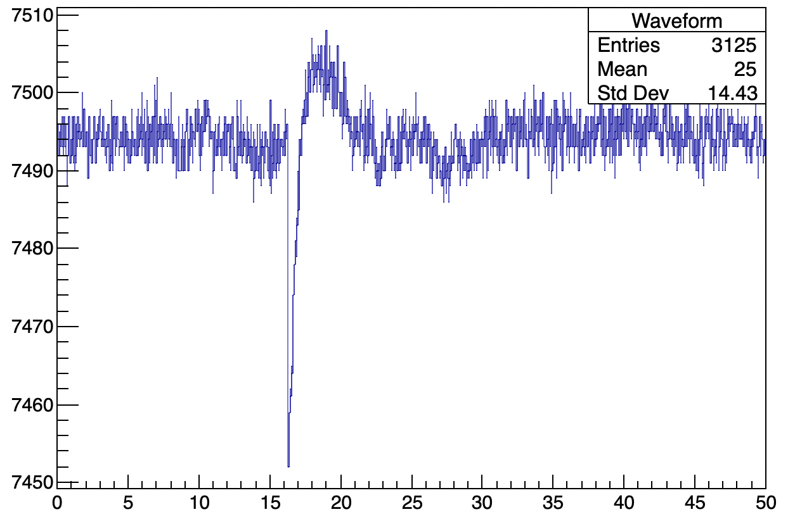
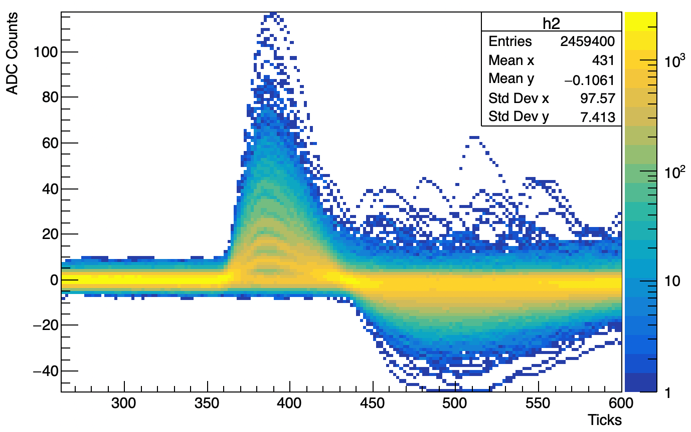

# dune-pd-ana

A C++ analysis framework to estimate the performance of the [DUNE](https://www.dunescience.org) Photon Detection System

## In this repo
Here you can find macros (file.cpp in [this folder](Class/_c)) useful to plot the
persistence of a set of waveforms, compute the Signal-to-Noise ratio from
a calibration run, compute the FFTs of the electronic noise... In
[Macro_description.txt](Macro_description.txt) you can find a brief overview of what the macros do.
"Header" contains the .hpp files where all the functions are delcared,
divided in categories.
(OLD STYLE) The const.hpp file is the only one you should change to
adapt the codes to your dataset: it contains all the parameters needed for
your analysis.
(NEW STYLE) The ana_params.hpp file is the only one you should change to
adapt the codes to your dataset: it contains all the parameters needed for
your analysis. This file is automatically generated by the class methdos "update()".

The codes are desigend to run interactively in a ROOT session. To open the ROOT
session you should run the following commands:
```bash
root
#include "const.hpp"
#include "/PathToThisRepo/pds-ana/Class/classe.hpp"
auto a = cla()
```
Where const.hpp (OLD VERSION) / ana_params.hpp (NEW VERSION) must be in the folder where you
launch the ROOT session. At this point, you can start play with `a`.
Personally, I have a bash/zsh alias to launch the ROOT session with the alias `c` copy a template const.hpp 
in the current folder and to launch the session. (see [scripts](scripts))

If you used the OLD VERSION of this class, you can easily migrate to the NEW
VERSION by running the following commands in a folder where you have the const.hpp file:
```bash
c const.hpp
a.update()
```
This will create the ana_params.hpp file and now you can use the NEW VERSION of the class
just by the alias `c`.

## Go faster
If are not developing the codes, you can use the compiled version of the class
by running the following command:
```bash
c +
```
which will compile the codes for you. 

## Get started
Whatever you want to do, the first step is to read the data. Be sure that your
data are in a supported format, or write a function that store it in an
std::vector<std::vector<double>>. The `data_format` member allows yu to specify
the function want to use with a simple tag.
```bash
a.data_format = "tag"
a.wf_file = "path/the_file_to_read"
a.memorydepth = #NumberOfTicksPerWf
a.prepulse_ticks = #NumberOfTicksToEvaluateTheBaseline
a.Persistence()
```

Check if everything is correct!

You should see something like:

Keep going with the Enter command.

Hey, your pulse is negative! Let's invert it with:

```bash
a.invert = true/false
```

Now you should see something like:


If you are happy with this starting point, let's update the initial parameters
of the class by:
```bash
a.update()
```
This modifies the const.hpp file, so that the next time you lanch a session you
will resume from the last checkpoint.

 Keep going!
 Run `AverageWF()`, find an integration window [`int_low`; `int_up`], run
 `LED_Analysis()` and look at the
 [Images](Images) folder to have an idea of what else you can do.

### Author
Federico Galizzi - f.galizzi1@campus.unimib.it
